# TravelMate

## Nombre grupo

Grupo 3

## Roles

**CEO** - Iago Domínguez Cameán  
**COO** - Diego Villodas Zapata  
**CTO** - Pablo Mariño Boga  
**CXO** - Dennimar Gil Ortega  

## Proyecto

### Caracteristicas de la aplicación Buscador de rutas

1. **Creación de rutas entre varios puntos:**
   - Permitir a los usuarios seleccionar múltiples puntos de partida y destino para crear una ruta personalizada.
   - Proporcionar opciones para ajustar la ruta según las preferencias, como una ruta panorámica para aquellos que disfrutan viajando en moto o en coche, maximizando la experiencia escénica y el disfrute del trayecto, u otras opciones basadas en la eficiencia económicas o ambiental.

2. **Recomendaciones de rutas turísticas en los puntos de destino:**
   - Ofrecer diversas opciones de rutas turísticas en los puntos de destino, adaptadas para recorrer a pie, en bicicleta o utilizando transporte público.
   - Ofrecer rutas temáticas basadas en deseos turísticos: arquitectura, arte callejero, naturaleza, ocio, etc.
   - Ofrecer rutas basadas en el número de días en el lugar de destino (facilitando la planificación diaria).
   - Proporcionar información detallada sobre la distancia, el tiempo estimado de viaje y los lugares destacados en cada ruta.

3. **Notificaciones de POI (puntos de interés) cercanos:**
   - Enviar notificaciones a los usuarios sobre puntos de interés cercanos a su ubicación durante el recorrido.
   - Permitir a los usuarios filtrar los tipos de puntos de interés que desean recibir notificaciones, como monumentos históricos, restaurantes, miradores, etc.

4. **Sugerencias para crear fotografías de POI:**
   - Proporcionar sugerencias creativas para tomar fotografías en puntos de interés, como ángulos interesantes, composiciones únicas, ubicaciones ideales, o momentos del día ideales para capturar la mejor imagen.
   - Incorporar ejemplos de fotografías tomadas por otros usuarios para inspirar a los viajeros.

5. **Realidad aumentada para orientarse en las rutas:**
   - Integrar funcionalidades de realidad aumentada para ayudar a los usuarios a orientarse en las rutas, mostrando indicaciones visuales sobre puntos de interés, direcciones y distancias.
   - Permitir a los usuarios ver información adicional sobre los lugares a través de la superposición de datos en tiempo real.

6. **Listas de reproducción que se ajustan a la duración del viaje:**
   - Generar listas de reproducción de música adaptadas a la duración estimada del viaje, en base a preferencias musicales.
   - Permitir a los usuarios crear listas de reproducción personalizadas o seleccionar listas curadas según el tipo de viaje o destino.

7. **Listas de reproducción que recomiendan artistas locales:**
   - Recomendar artistas locales y música regional para enriquecer la experiencia de viaje y apoyar a la escena musical local, o bien basada en el punto de destino.
   - Integración con redes sociales: Facilitar compartir las rutas planeadas y las experiencias de viaje en redes sociales, permitiendo a otros usuarios descubrir nuevas rutas y destinos.

8. **Función de guía de audio:**
   - Ofrecer guías de audio narrativas proporcionando información histórica, cultural y práctica sobre los lugares visitados.

9. **Mapas sin conexión:**
   - Permitir a los usuarios descargar mapas y rutas para su uso sin conexión a internet, facilitando la exploración de destinos remotos o la reducción de costes de roaming.

10. **Integración con redes sociales:**
    - Facilitar compartir las rutas planeadas y las experiencias de viaje en redes sociales, permitiendo a otros usuarios descubrir nuevas rutas y destinos.

## Target

Nuestro público objetivo abarca una amplia gama de personas que disfrutan de la experiencia de viajar, aprovechando la accesibilidad que existe en la actualidad para todos los presupuestos. Aun teniendo un objetivo de masas, en particular, **el público joven**, encontrará en nuestra aplicación una herramienta para mejorar su experiencia turística con propuestas interesantes que les permiten recibir sugerencias sobre lugares para tomar fotografías y compartirlas con sus seguidores en redes sociales.

Además, nuestra aplicación ofrece **rutas predefinidas** que brindan apoyo a personas con menos experiencia en este tipo de viajes, proporcionando una alternativa a las visitas guiadas convencionales, con la **libertad** que esto supone. También a nivel **económico** puede suponer una alternativa, ya que elimina la necesidad de contratar guías adicionales, lo que implica un ahorro significativo para los usuarios.

En el ámbito **cultural**, además de ofrecer **playlists personalizadas** adecuadas a la duración del viaje, también proporcionamos la oportunidad de descubrir y disfrutar de la música de **artistas locales**. Esto enriquece la experiencia al combinar funcionalidades que generalmente no se encuentran integradas en las aplicaciones de uso común, resultando especialmente atractivo para aquellos que desean sumergirse culturalmente en su lugar de destino.

Todo esto nos hace conscientes de que nuestra propuesta debe estar diseñada para satisfacer las necesidades de un **volumen notable de usuarios**, asegurando una experiencia de usuario fluida y satisfactoria para todos.

En resumen, buscamos a personas apasionadas por viajar y compartir sus experiencias, interesadas en hacer de cada viaje una experiencia completa y enriquecedora. Este **usuario ideal** valora tanto la exploración de nuevos lugares como la inmersión cultural en cada destino.

## Estudio de mercado

### Aplicaciones similares

**CityMaps2Go** :  
Dispone de mapas con/sin conexión y la propia aplicación te recomienda que mapas descargar. Solo los recomendará si haces el zoom suficiente en el mapa de la aplicación.  
   

   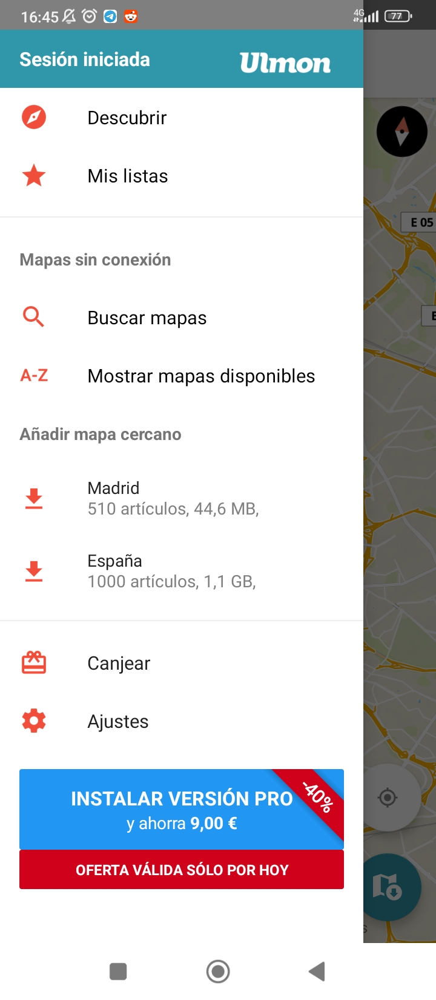

Con la función **Descubrir** te muestra listas de POI en base a unos filtros predefinidos o filtros personalizados por el usuario.  
   

   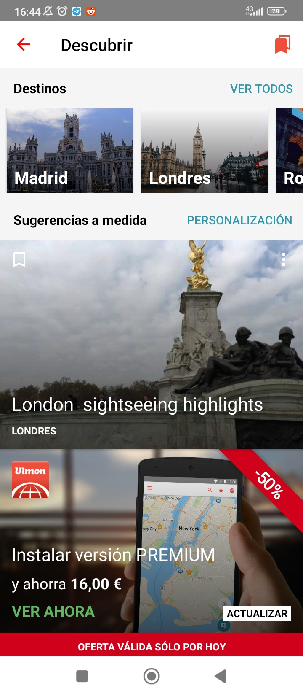

Por ejemplo al seleccionar London sightseeing highlights, se nos muestran una serie de POI relacionados con ese filtro. Si seleccionamos una ciudad de la que aparecen arriba nos saldrán filtros como este. También es posible usar otro tipo de filtros como hoteles, restaurantes, etc.  

   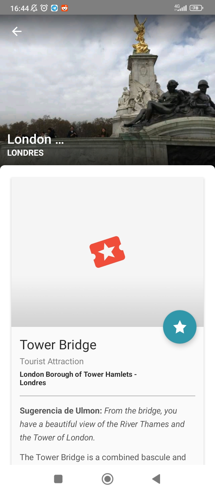

Al seleccionar uno  de los POI que se nos recomienda con los filtros se nos muestra una descripción de este e información adicional, como sitios para dormir cercanos y fotos populares de dicho lugar. Además de darnos una valoración numérica del POI.  

   
   

Estos POI los puedes añadir a una lista, las listas representan los viajes que hayas hecho y cada una tiene un nombre único para cada usuario. Una vez que añades un POI a una lista este aparecerá marcado en el mapa. Las listas se pueden editar, cambiar el color del icono de los POI en el mapa y su forma para diferenciar cada lista, también puedes cambiar el nombre de la lista.

   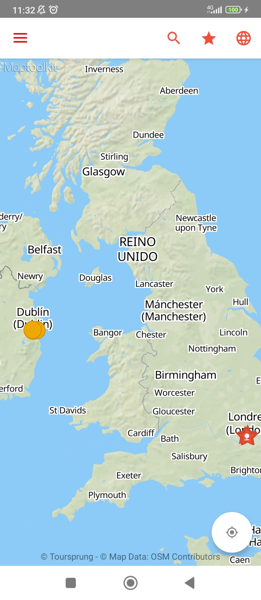

**Maps.me** :  
Es la que más se acerca a nuestra idea, aunque solo funciona con mapas sin conexión. También te permite descargar los mapas si haces el suficiente zoom. Creas una lista de POI a los que quieres ir oredenados por ti y te genera una ruta en base al orden que hayas indicado. Genera la ruta más rapida andando, en coche, transporte público. 

   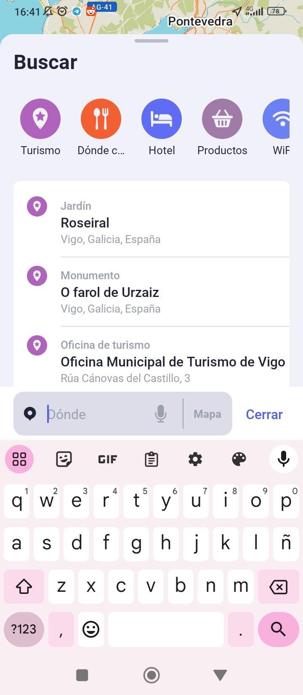
   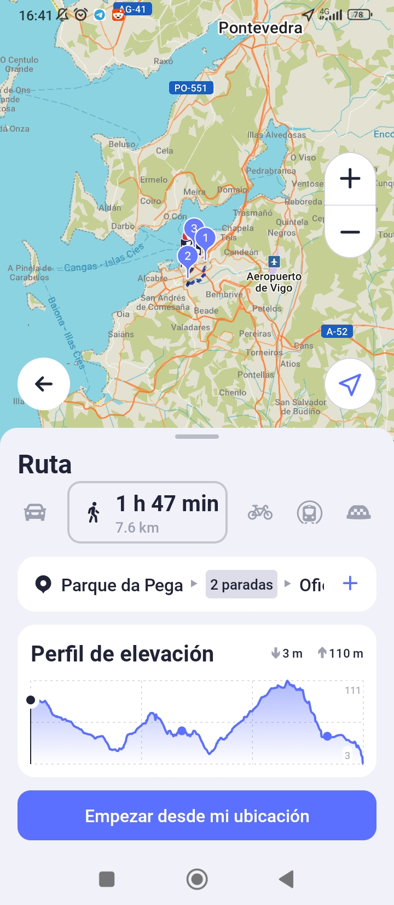
   

  

Como podemos ver también disponde de filtros predefinidos, pero no podemos crear los nuestros propios, a diferencia de la anterior.  

**Wikiloc** :  
Diseñada para entusiastas del senderismo, ciclismo, trail running. Puede realizar exploración, grabación y compartir de rutas, Descarga de mapas offline, proporciona información detallada de la ruta y creación de fotos.

   
   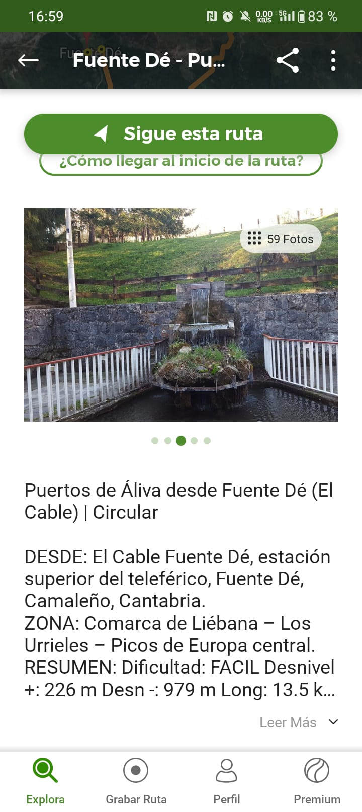
   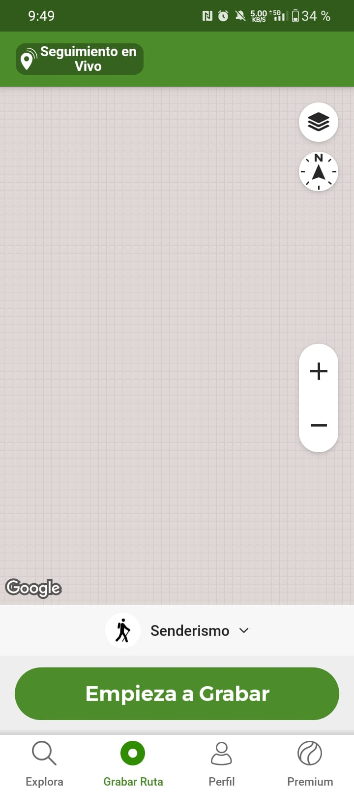
   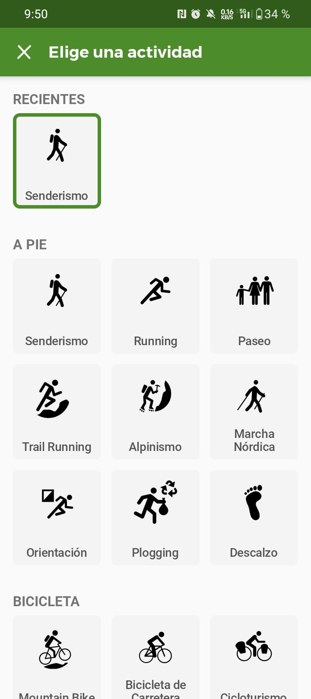

  

**Here WeGo** :  
La aplicación permite a los usuarios planificar sus rutas, la capacidad de descargar mapas para usarlos sin conexión, proporciona información detallada sobre puntos de interés cercanos, como restaurantes, áreas de descanso, miradores y lugares históricos, alertas en tiempo real sobre el tráfico, las condiciones del camino y los peligros potenciales en la ruta.

   
   
   

  

### Conclusiones
Para diferenciarnos de la competencia ofrecemos opciones de personalización avanzadas para las preferencias del usuario. 

Basándonos en el estudio realizado anteriormente podemos dar ejemplo de cómo la capacidad de ajustar las notificaciones, las sugerencias de fotografías y las listas de reproducción según los gustos individuales. A su vez ofrecer rutas más precisas y eficientes entre varios puntos y que en cada ubicación, mostrar artistas locales, así como una navegación fluida y sin problemas con realidad aumentada.

Por consiguiente se mantendrá la aplicación actualizada con nuevas funciones, correcciones de errores y mejoras basadas en los comentarios de los usuarios. Para así tener un compromiso con la satisfacción del cliente a largo plazo, de esta forma se estaría fidelizando al cliente.  

## Diseño de la arquitectura de comunicaciones

Involucra el uso de múltiples APIs y servicios online que la aplicación consume como cliente.

- **Google Places, Routes y Maps APIs**: APIs utilizadas para generar rutas, buscar lugares y visualizar mapas.

- **Spotify API**: Se utiliza para interactuar con Spotify y crear listas de reproducción.

- **Google Sign-In API o Google OAuth 2.0**: Esta API se utiliza para gestionar la autenticación y autorización de los usuarios en la aplicación obteniendo información como Nombre completo, Dirección de correo electrónico, Foto de perfil e información de contactos.

- **Foursquare, Wikimedia Commons y OpenWeather APIs**: Estas APIs se utilizan para obtener información sobre los lugares por los que pasa la ruta. La aplicación envía solicitudes para obtener detalles sobre puntos de interés, imágenes de lugares y datos meteorológicos locales.

- **Sensores GPS y magnetómetro**: La aplicación utiliza los sensores del dispositivo (GPS y magnetómetro) para hacer el seguimiento de la ruta del usuario y proporcionar información precisa sobre la ubicación y la orientación.

- **Almacenamiento interno**: Se utiliza para almacenar fotografías y datos de la aplicación y configuraciones de manera local en el dispositivo del usuario.

- **Compartir**: Este módulo permite a los usuarios compartir sus rutas, listas de reproducción u otra información generada por la aplicación a través de plataformas de redes sociales, correo electrónico u otras aplicaciones instaladas en el dispositivo.

## Mockups

Desde la pantalla inicial se puede buscar por lugares destacados/filtros/rutas recomendadas o que el usuario busque manualmente. Podemos por un lado, crear rutas desde un punto origen y un punto destino, y por otro lado, directamente buscar destinos. En el segundo caso, seleccionaremos una de las rutas disponibles para ese destino.

Al seleccionar una ruta, los usuarios son dirigidos al mapa con la ruta ya cargada, donde tienen la opción de acceder a la vista en realidad aumentada o a una audioguía, según sus preferencias. Además, desde cualquier pantalla, pueden acceder rápidamente al mapa haciendo clic en el icono correspondiente.

Adicionalmente, ofrecemos la opción de explorar zonas donde la comunidad haya compartido fotografías de lugares de interés cercanos, permitiendo a los usuarios visualizar y disfrutar de estas imágenes.

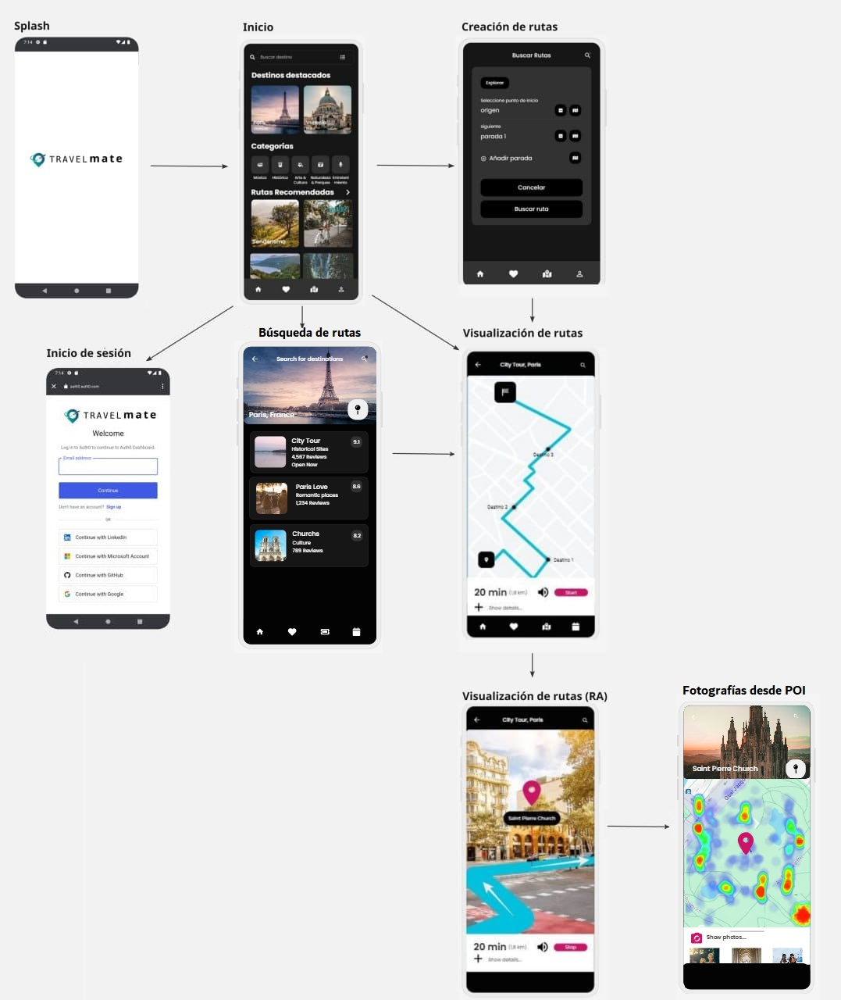

### Versión 1 Android Studio

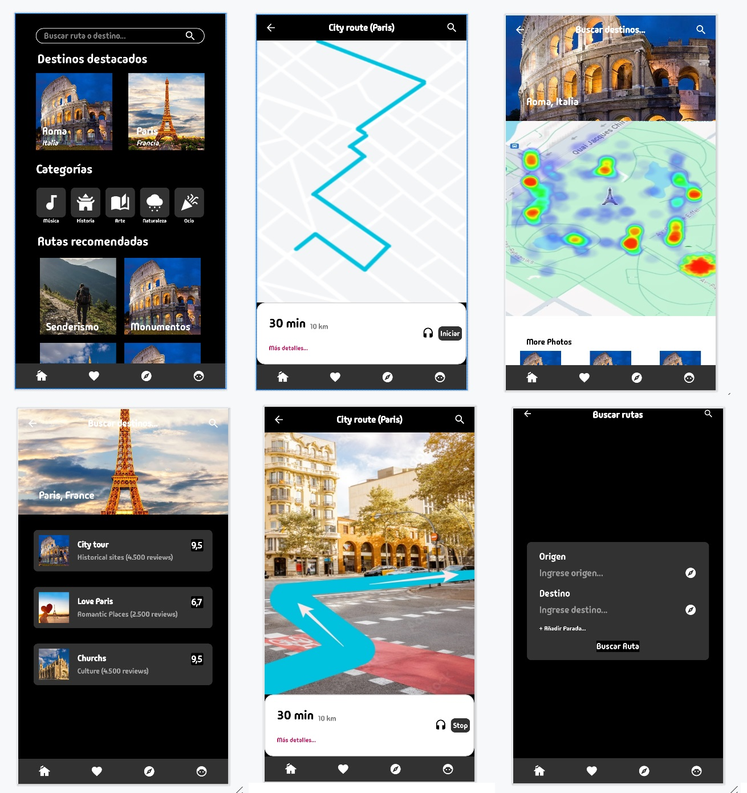

1. Home de la aplicación
2. Detalle de ruta
3. Detalle de punto de interés
4. Detalle de destino
5. Detalle de ruta iniciada
6. Crear ruta

## Componentes de la App

**¿Qué se pretende implementar como actividad?**

En nuestra aplicación, pretendemos implementar el inicio de sesión como una actividad principal, donde la función principal sea proporcionar al usuario una experiencia de autenticación segura y confiable basada en OAuth, mediante los elementos globales de la actividad.

**¿Qué se va a implementar como un servicio?**

Las llamadas interactivas a las APIs externas de Google Maps y Spotify se implementarán como servicios con el fin de garantizar que todas las funciones requeridas estén integradas y funcionando correctamente en diferentes dispositivos, a través de la lógica proporcionada por las APIs, de manera que sea transparente al diseño de la aplicación.

**¿Qué se va a implementar con Fragments?**

En nuestra aplicación, se implementarán los siguientes fragments: HomeFragment, UserFragment, MapFragment, SearchFragment y RouteFragment. Estos fragments ayudarán en la comunicación entre sí y con la actividad principal, para facilitar la navegabilidad entre pantallas.

**Cómo se lanzan los fragments y servicios**

El HomeFragment enlaza con: 
* SearchFragment
* UserFragment

El MapFragment enlaza con:
* GoogleMapsService
* SearchFragment
     * Spotify Service

El SearchFragment enlaza con:
* HomeFragment
* RouteFragment

**Tareas en segundo plano**  
El seguimiento con google maps y la actividad del mapa necesitarían estar ejecutandose en segundo plano.

Hace falta actualizar el MapFragment a MapActivity para poder interactuar con el mapa, no se ha encontrado como hacer que el fragment haga que se pueda interactuar con el mapa y revisar la navegación para poder acceder al RouteFragment.

**Geolocalización**

Se solicitan permisos de FINE_LOCATION y COARSE_LOCATION, ya que vamos a usar el mapa para guiar al usuario a todos los puntos de la ruta que quiere seguir, si sale y vuelve a entrar a la aplicación tenemos que poder seguir donde se quedó antes de salir. Se solicitarán cuando se intente abrir el **MapFragment**.

**Almacenamiento**

Nuestra aplicación utiliza [Auth0](https://auth0.com/) de Okta para la gestión de identidad y accesos. Este servicio da la opción al usuario de registrar un nuevo usuario o utilizar la identidad de la que dispone en otros servicios como Google, Facebook...

El funcionamiento es sencillo, la primera vez que el usuario accede a la aplicación se le solicita que inicie sesión utilizando alguna de las opciones disponibles. En cuanto finaliza el proceso correctamente la aplicación recibe un JWT (Java Web Token) que contiene los siguientes datos de usuario:

- id
- name
- email
- emailverified
- picture
- updatedAt
- expiresAt
  
Esta información se almacena localmente utilizando Shared Preferences. Para no solicitar el inicio de sesión mas veces de las necesarias comprobamos si el fichero de preferencias existe y no ha expirado antes de solicitar el inicio de sesión 

**Mejora de usabilidad y experiencia de usuario**

Mejoras de usabilidad propuestas.
Tras discutirlo en grupo y solicitar feedback a usuarios, que no participan en el desarrollo del proyecto, hemos detectado los siguientes problemas:
- **Reducción de la barrera en la pantalla de inicio de sesión:** Hemos observado que la pantalla de inicio de sesión puede ser una barrera para el usuario, ya que es la primera pantalla que encuentra al navegar por la aplicación. Esta pantalla impide evaluar completamente lo que ofrece la aplicación antes de realizar el registro o iniciar sesión. Tras discutirlo en grupo y solicitar feedback a usuarios externos al equipo de desarrollo, hemos decidido mover la acción de inicio de sesión a la pestaña del usuario, permitiendo así que el usuario explore el contenido disponible antes de decidir si desea registrarse o iniciar sesión.
- **Mejoras en la legibilidad de los textos:** hemos revisado los tamaños de los textos que podian resultar más dificiles de leer, en los grids de imagenes hemos añadido una recuadro de color bajo los textos para mejorar su legibilidad.
- Revisión del tamaño de las areas clickables de los todos los botones, prestando especial atención a la zona de busqueda del apartado de rutas para darle mayor importancia.
- **Optimización del tamaño de las áreas clickables de los botones:** Se ha llevado a cabo una revisión del tamaño de las áreas clickables de todos los botones, prestando especial atención a la zona de búsqueda en el apartado de rutas para darle mayor importancia y facilitar su uso
- **Adaptación del layout para dispositivos móviles en posición vertical con una sola mano:** Considerando que el usuario probablemente utilizará un teléfono móvil en posición vertical y con una sola mano, hemos revisado el layout de todos los elementos para asegurarnos de que resulten cómodos y accesibles para el usuario en esta configuración.

Implementación de material design
- En la sección de usuario, hemos añadido la opción de cambiar de tema, siguiendo los principios de Material Design para proporcionar una experiencia visualmente atractiva y coherente en toda la aplicación.

   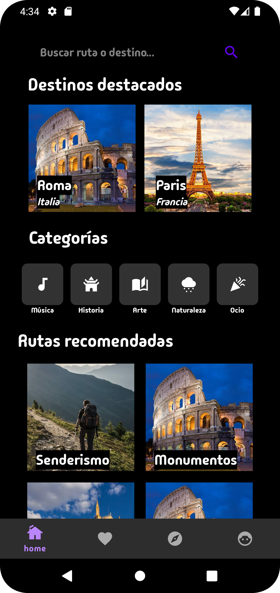
   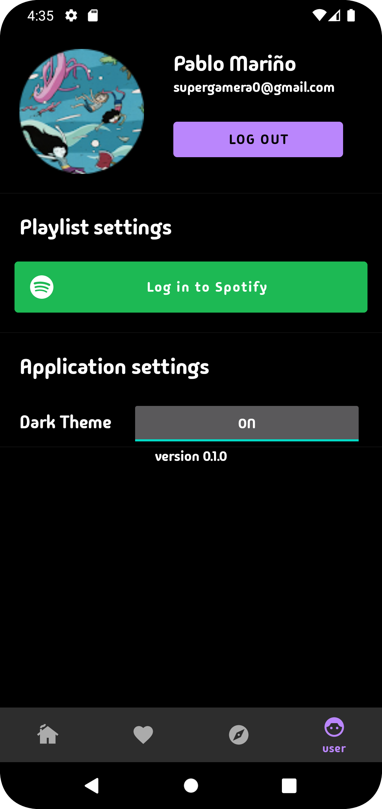
   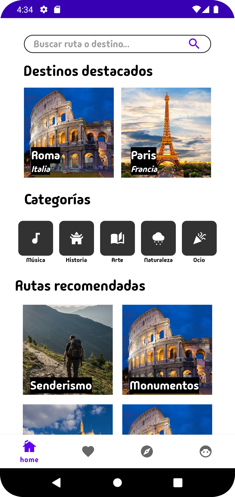

## Necesidades/funcionalidades de elementos multimedia.

**TODO**

## Necesidades/funcionalidades de sensorizado.

**GPS para Geolocalización**

## Lean canvas de la app.

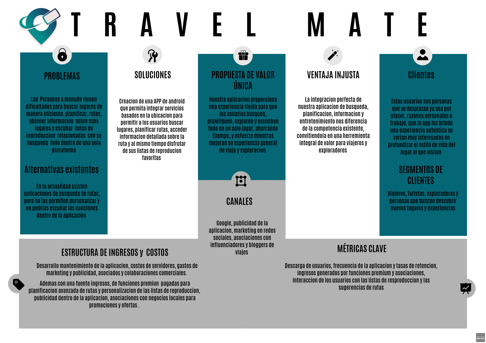

## Cierre del proyecto

En este último sprint hemos añadido algunas nuevas caracteristicas a la aplicación que habian quedado pendientes:

- Generación de rutas.

  

   
- Contenido dinámico en la sección Home. Preparando la aplicación para cargar contenido dinamico almacenadoen formato JSON. Estos datos contienen información de los lugares recomendados y las diferentes categorias que se muestran en la pantalla Home

  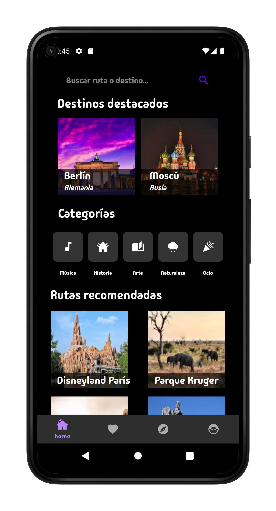

   
- Carga de datos de playlists a traves de API de Spotify. Conectamos la aplicación con la API de Spotify para consumir datos sobre playlists que muestra la aplicación. 

- Creación de sección para listado de canciones. Implementamos una nueva sección en la que se muestran los datos de las playlists.

  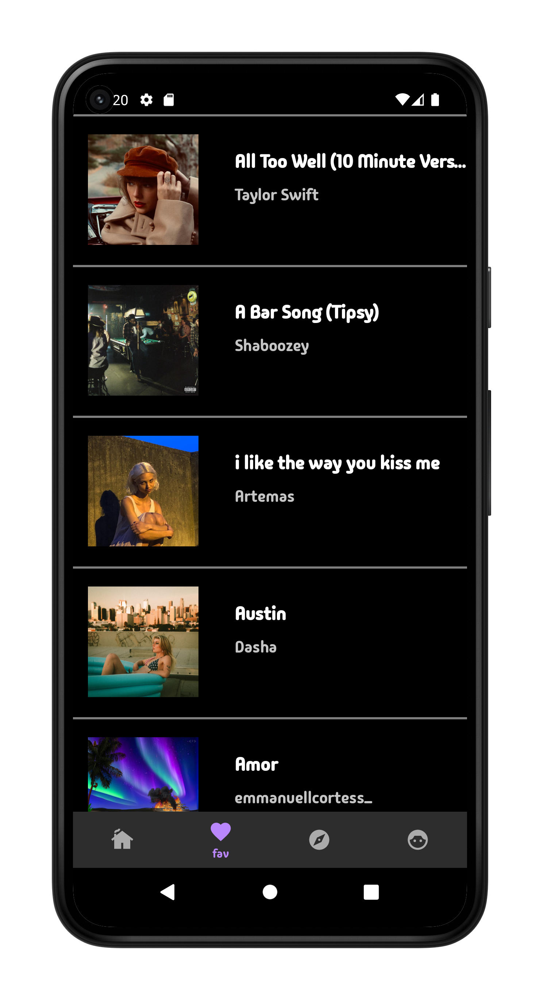

   
- Creación del video de presentación de la aplicación. Que muestra las principales características de la aplicación 
[travelMATE Trailer](https://udcgal.sharepoint.com/:v:/r/sites/APM-PracticaGrupo3/Documentos%20compartidos/General/TRAVELMATE%201.mp4?csf=1&web=1&e=cnGrQ3), para el montaje hemos utilizado los siguientes clips:   [Bill Gates and Steve Ballmer dancing - Windows 95 launch](https://www.youtube.com/watch?v=ojP0BO6H4Qcali), [Steve Ballmer (Microsoft): "Developers, developers, developers!" ](https://www.youtube.com/watch?v=I-u8fo5esYI), [Bag Raiders - Shooting Stars (Official Video)](https://www.youtube.com/watch?v=feA64wXhbjo).
   
- Solución de múltiples bugs:
   
  1. Error que impedia cargar el tema guardado para la aplicación al inicio
  2. Comportamiento errático del dialogo de selección de rutas
  3. Necesidad de refrescar sección tras solicitud de permisos para acceder a localización de dispositivo.

### Roles efectivos

Los roles asignados inicialmente a los miembros del grupo se mantuvieron con ligeras modificaciones a lo largo del proyecto. Durante el desarrollo, ha sido habitual no poder contar con todos los miembros del grupo, ya sea por motivos laborales o personales. Debido a esta circunstancia, el resto del equipo de desarrollo se ha hecho cargo momentáneamente de la toma de decisiones en los ámbitos del proyecto que era necesario, asegurándose de consensuar las decisiones tomadas.

### Modificaciones sobre el proyecto original y Tareas Pendientes

Esta versión de la aplicación se trata de un producto mínimo viable y por ello han quedado fuera muchas características planificadas originalmente.
Estas características son todas evoluciones naturales de una base diseñada para mejorar la experiencia del usuario en viajes y exploraciones:

- **Notificaciones de POI (puntos de interés) cercanos:** En un futuro se basarán en la ubicación del usuario, accediendo a la infraestructura ya montada de la ubicación.

- **Sugerencias para crear fotografías de POI:** Esta función podría ofrecer consejos sobre cómo tomar las mejores fotografías en puntos de interés específicos. Dado que esa una funcionalidad que depende en buena medida del grado de adopción de la aplicación, y no es algo prioritario, se pospone para próximas evoluciones.

- **Realidad aumentada para orientarse en las rutas:** La realidad aumentada podría integrarse en la aplicación de navegación para superponer información útil sobre el entorno del usuario mientras navega por las rutas, complementando los menús de mapas ya existentes.

- **Listas de reproducción que se ajustan a la duración del viaje:** Se ha superado la fase crítica de integrar y combinar los servicios de Google Maps y Spotify, por lo que es abordable en un futuro sin grandes conflictos.

- **Listas de reproducción que recomiendan artistas locales:** Esta característica sugeriría música de artistas locales basada en la ubicación del usuario.

- **Función de guía de audio:** Pendiente de extracción y generación de textos, así como la generación de audios propias.

- **Mapas sin conexión:** Se ha excluido del MVP, porque y se implementará tras validar la App en muestra de población representativas.

- **Integración con redes sociales**, como Instagram, Facebook o Twitter. Intregación con Spotify ya validada.
  
Seguimos confiando en que añadir estas características mejorara la aplicación y permitirá distinguirla de la competencia, pero las restricciones de tiempo y esfuerzo del proyecto no nos han permitido abordarlas, y se ha construir una base sólida, que permita crecer de forma controlada.

 

