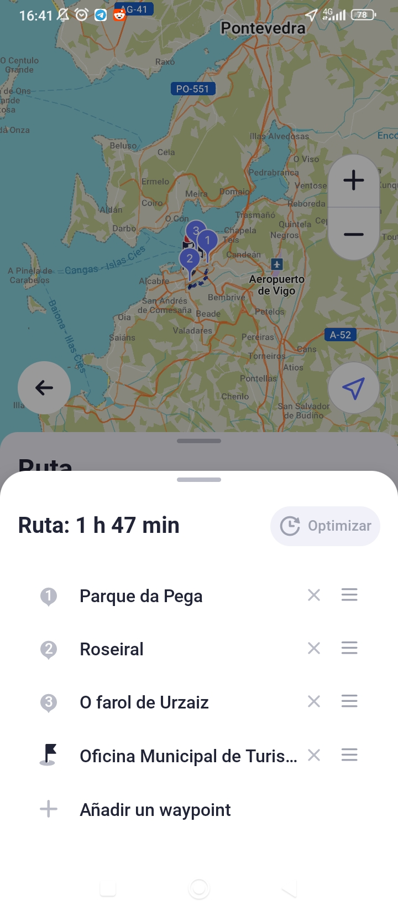
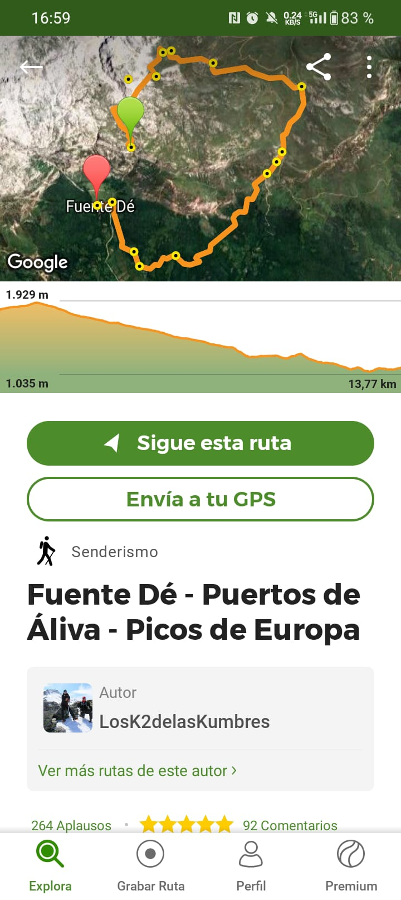
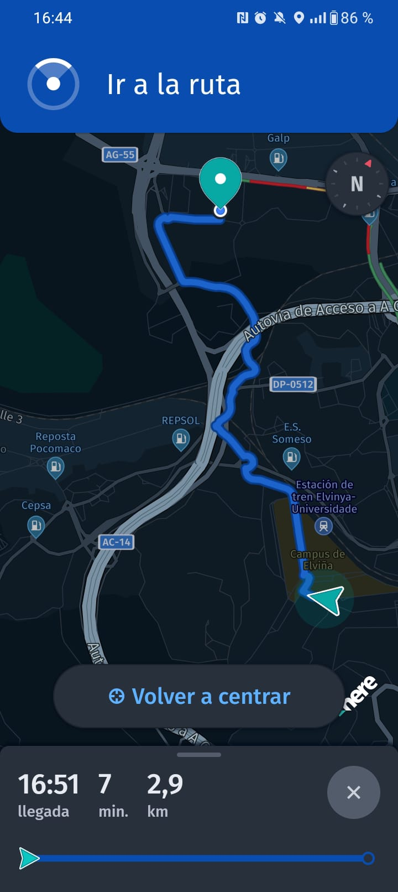
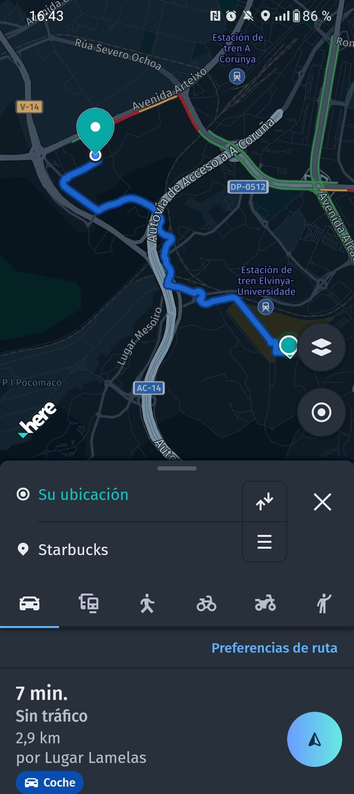
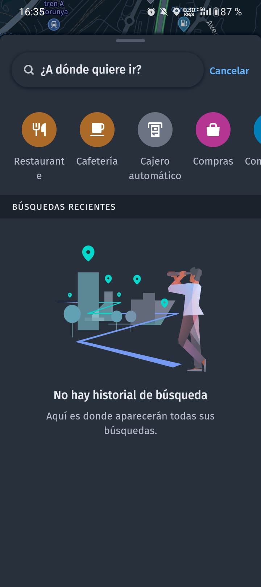

# Buscador de rutas

## Nombre grupo

Grupo 3

## Roles

**CEO** - Iago Domínguez Cameán  
**COO** - Diego Villodas Zapata  
**CTO** - Pablo Mariño Boga  
**CXO** - Dennimar Gil Ortega  

## Proyecto

### Caracteristicas de la aplicación Buscador de rutas

1. **Creación de rutas entre varios puntos:**
   - Permitir a los usuarios seleccionar múltiples puntos de partida y destino para crear una ruta personalizada.
   - Proporcionar opciones para ajustar la ruta según las preferencias, como una ruta panorámica para aquellos que disfrutan viajando en moto o en coche, maximizando la experiencia escénica y el disfrute del trayecto, u otras opciones basadas en la eficiencia económicas o ambiental.

2. **Recomendaciones de rutas turísticas en los puntos de destino:**
   - Ofrecer diversas opciones de rutas turísticas en los puntos de destino, adaptadas para recorrer a pie, en bicicleta o utilizando transporte público.
   - Ofrecer rutas temáticas basadas en deseos turísticos: arquitectura, arte callejero, naturaleza, ocio, etc.
   - Ofrecer rutas basadas en el número de días en el lugar de destino (facilitando la planificación diaria).
   - Proporcionar información detallada sobre la distancia, el tiempo estimado de viaje y los lugares destacados en cada ruta.

3. **Notificaciones de POI (puntos de interés) cercanos:**
   - Enviar notificaciones a los usuarios sobre puntos de interés cercanos a su ubicación durante el recorrido.
   - Permitir a los usuarios filtrar los tipos de puntos de interés que desean recibir notificaciones, como monumentos históricos, restaurantes, miradores, etc.

4. **Sugerencias para crear fotografías de POI:**
   - Proporcionar sugerencias creativas para tomar fotografías en puntos de interés, como ángulos interesantes, composiciones únicas, ubicaciones ideales, o momentos del día ideales para capturar la mejor imagen.
   - Incorporar ejemplos de fotografías tomadas por otros usuarios para inspirar a los viajeros.

5. **Realidad aumentada para orientarse en las rutas:**
   - Integrar funcionalidades de realidad aumentada para ayudar a los usuarios a orientarse en las rutas, mostrando indicaciones visuales sobre puntos de interés, direcciones y distancias.
   - Permitir a los usuarios ver información adicional sobre los lugares a través de la superposición de datos en tiempo real.

6. **Listas de reproducción que se ajustan a la duración del viaje:**
   - Generar listas de reproducción de música adaptadas a la duración estimada del viaje, en base a preferencias musicales.
   - Permitir a los usuarios crear listas de reproducción personalizadas o seleccionar listas curadas según el tipo de viaje o destino.

7. **Listas de reproducción que recomiendan artistas locales:**
   - Recomendar artistas locales y música regional para enriquecer la experiencia de viaje y apoyar a la escena musical local, o bien basada en el punto de destino.
   - Integración con redes sociales: Facilitar compartir las rutas planeadas y las experiencias de viaje en redes sociales, permitiendo a otros usuarios descubrir nuevas rutas y destinos.

8. **Función de guía de audio:**
   - Ofrecer guías de audio narrativas proporcionando información histórica, cultural y práctica sobre los lugares visitados.

9. **Mapas sin conexión:**
   - Permitir a los usuarios descargar mapas y rutas para su uso sin conexión a internet, facilitando la exploración de destinos remotos o la reducción de costes de roaming.

10. **Integración con redes sociales:**
    - Facilitar compartir las rutas planeadas y las experiencias de viaje en redes sociales, permitiendo a otros usuarios descubrir nuevas rutas y destinos.

## Target

Nuestro público objetivo abarca una amplia gama de personas que disfrutan de la experiencia de viajar, aprovechando la accesibilidad que existe en la actualidad para todos los presupuestos. Aun teniendo un objetivo de masas, en particular, **el público joven**, encontrará en nuestra aplicación una herramienta para mejorar su experiencia turística con propuestas interesantes que les permiten recibir sugerencias sobre lugares para tomar fotografías y compartirlas con sus seguidores en redes sociales.

Además, nuestra aplicación ofrece **rutas predefinidas** que brindan apoyo a personas con menos experiencia en este tipo de viajes, proporcionando una alternativa a las visitas guiadas convencionales, con la **libertad** que esto supone. También a nivel **económico** puede suponer una alternativa, ya que elimina la necesidad de contratar guías adicionales, lo que implica un ahorro significativo para los usuarios.

En el ámbito **cultural**, además de ofrecer **playlists personalizadas** adecuadas a la duración del viaje, también proporcionamos la oportunidad de descubrir y disfrutar de la música de **artistas locales**. Esto enriquece la experiencia al combinar funcionalidades que generalmente no se encuentran integradas en las aplicaciones de uso común, resultando especialmente atractivo para aquellos que desean sumergirse culturalmente en su lugar de destino.

Todo esto nos hace conscientes de que nuestra propuesta debe estar diseñada para satisfacer las necesidades de un **volumen notable de usuarios**, asegurando una experiencia de usuario fluida y satisfactoria para todos.

En resumen, buscamos a personas apasionadas por viajar y compartir sus experiencias, interesadas en hacer de cada viaje una experiencia completa y enriquecedora. Este **usuario ideal** valora tanto la exploración de nuevos lugares como la inmersión cultural en cada destino.

## Estudio de mercado

### Aplicaciones similares

**CityMaps2Go** :  
Dispone de mapas con/sin conexión y la propia aplicación te recomienda que mapas descargar. Solo los recomendará si haces el zoom suficiente en el mapa de la aplicación.  
   

   

Con la función **Descubrir** te muestra listas de POI en base a unos filtros predefinidos o filtros personalizados por el usuario.  
   

   

Por ejemplo al seleccionar London sightseeing highlights, se nos muestran una serie de POI relacionados con ese filtro. Si seleccionamos una ciudad de la que aparecen arriba nos saldrán filtros como este. También es posible usar otro tipo de filtros como hoteles, restaurantes, etc.  

   

Al seleccionar uno  de los POI que se nos recomienda con los filtros se nos muestra una descripción de este e información adicional, como sitios para dormir cercanos y fotos populares de dicho lugar. Además de darnos una valoración numérica del POI.  

   
   

Estos POI los puedes añadir a una lista, las listas representan los viajes que hayas hecho y cada una tiene un nombre único para cada usuario. Una vez que añades un POI a una lista este aparecerá marcado en el mapa. Las listas se pueden editar, cambiar el color del icono de los POI en el mapa y su forma para diferenciar cada lista, también puedes cambiar el nombre de la lista.

   

**Maps.me** :  
Es la que más se acerca a nuestra idea, aunque solo funciona con mapas sin conexión. También te permite descargar los mapas si haces el suficiente zoom. Creas una lista de POI a los que quieres ir oredenados por ti y te genera una ruta en base al orden que hayas indicado. Genera la ruta más rapida andando, en coche, transporte público. 

   
   
   

  

Como podemos ver también disponde de filtros predefinidos, pero no podemos crear los nuestros propios, a diferencia de la anterior.  

**Wikiloc** :  
Diseñada para entusiastas del senderismo, ciclismo, trail running. Puede realizar exploración, grabación y compartir de rutas, Descarga de mapas offline, proporciona información detallada de la ruta y creación de fotos.

   
   

  

**Here WeGo** :  
La aplicación permite a los usuarios planificar sus rutas, la capacidad de descargar mapas para usarlos sin conexión, proporciona información detallada sobre puntos de interés cercanos, como restaurantes, áreas de descanso, miradores y lugares históricos, alertas en tiempo real sobre el tráfico, las condiciones del camino y los peligros potenciales en la ruta.

   
   
   

  

### Conclusiones
Para diferenciarnos de la competencia ofrecemos opciones de personalización avanzadas para las preferencias del usuario. 

Basándonos en el estudio realizado anteriormente podemos dar ejemplo de cómo la capacidad de ajustar las notificaciones, las sugerencias de fotografías y las listas de reproducción según los gustos individuales. A su vez ofrecer rutas más precisas y eficientes entre varios puntos y que en cada ubicación, mostrar artistas locales, así como una navegación fluida y sin problemas con realidad aumentada. 

Se mantendrá la aplicación actualizada con nuevas funciones, correcciones de errores y mejoras basadas en los comentarios de los usuarios. Para así tener un compromiso con la satisfacción del cliente a largo plazo, de esta forma se estaría fidelizando al cliente.  

## Diseño de la arquitectura de comunicaciones

Involucra el uso de múltiples APIs y servicios online que la aplicación consume como cliente.

- **Google Places, Routes y Maps APIs**: APIs utilizadas para generar rutas, buscar lugares y visualizar mapas.

- **Spotify API**: Se utiliza para interactuar con Spotify y crear listas de reproducción.

- **Google IAM (Identity and Access Management)**: Esta API se utiliza para gestionar la autenticación y autorización de los usuarios en la aplicación.

- **Foursquare, Wikimedia Commons y OpenWeather APIs**: Estas APIs se utilizan para obtener información sobre los lugares por los que pasa la ruta. La aplicación envía solicitudes para obtener detalles sobre puntos de interés, imágenes de lugares y datos meteorológicos locales.

- **Sensores GPS y magnetómetro**: La aplicación utiliza los sensores del dispositivo (GPS y magnetómetro) para hacer el seguimiento de la ruta del usuario y proporcionar información precisa sobre la ubicación y la orientación.

- **Almacenamiento interno**: Se utiliza para almacenar fotografías y datos de la aplicación y configuraciones de manera local en el dispositivo del usuario.

- **Compartir**: Este módulo permite a los usuarios compartir sus rutas, listas de reproducción u otra información generada por la aplicación a través de plataformas de redes sociales, correo electrónico u otras aplicaciones instaladas en el dispositivo.

